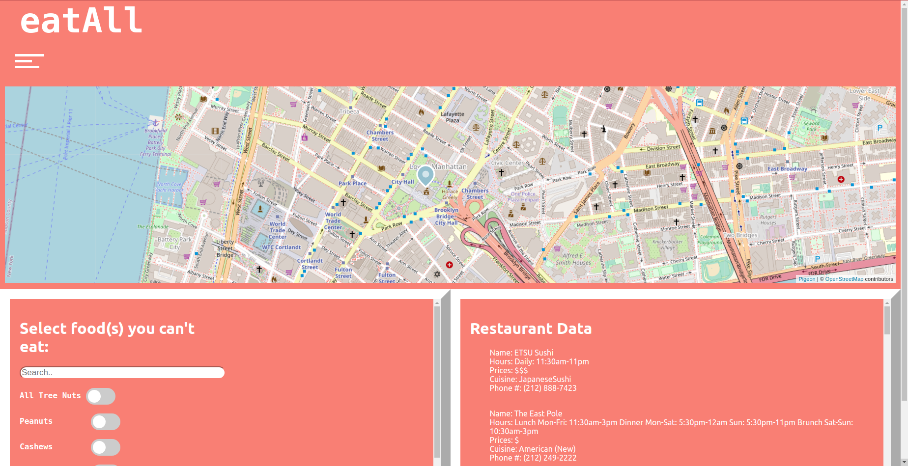

# [eatAll](https://eatall-app.herokuapp.com/): Restaurant Finding Service Application for those with dietary restrictions

# Purpose:

The purpose of this web application is to help those with dietary restrictions find convenient places to eat that allows them to eat without worrying. Dietary restrictions include religious practices to allergies.

# Inspiration:

Having an allergy to all nuts with the added affect of undergoing anaphylactic shock, finding a viable place to eat that makes all accompanying parties comforable is important. I hope that this application can be developed or implemented into larger services in the future. 

In Process:
Going to implement MySQL with Node js backend for user login. Should only require creating a table and linking NodeJs to SQL DB through express() and javascript
require method. Need to also add a login/create account button on UI. This button should just add a pop down menu or scroll to the bottom of the screen since
react works best for single page web applications. 

Issues:

The main issue with this lies in the data from the Documenu API. The amount of data that is available for restaurant menus is very limited. My current algorithm does a simple loop through the JSON object that is a nested response and search for keywords in which the correlating toggle state value has been changed. I'm looking into ways I can use Natural Language Processing javascript libraries and/or techniques to speed up run time as iterating through all loops and all restaurants (especially for large data sets where the radius presents hundreds of restaurants) is too slow. 
